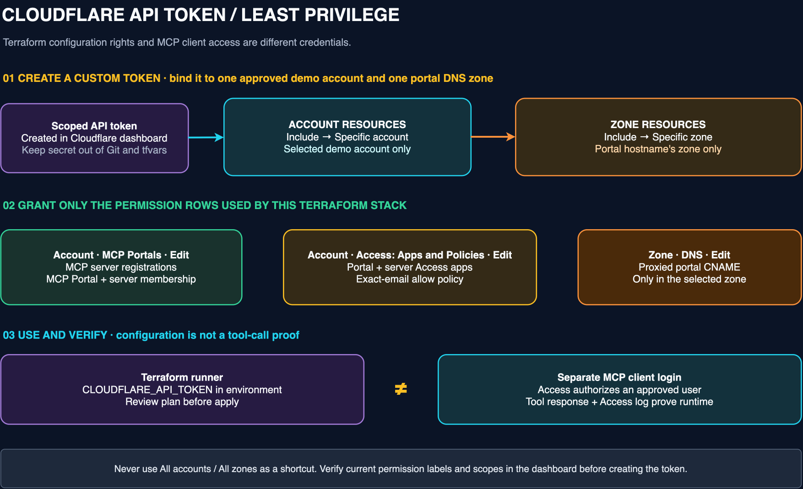
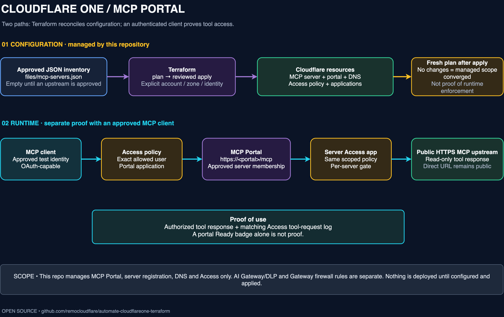

# Automate Cloudflare One with Terraform — complete demo

**One portal. An explicit server catalog. A narrowly scoped Access policy.** This independent Terraform example is intended to demonstrate how an approved MCP client reaches a read-only tool through Cloudflare One, then how a second Terraform plan confirms the managed configuration has converged.

> [!IMPORTANT]
> The checked-in configuration is account-neutral and contains no credentials. Local ignored inputs currently drive a disposable demo deployment; always review the selected account, zone, identities, and plan before applying elsewhere.

## At a glance

| Question | Answer |
| --- | --- |
| What does it create when explicitly enabled? | MCP portal/server controls, Entra and One-time PIN identity, explicit-email Access, an App Launcher and clientless Worker app, reusable Gateway DNS/HTTP blocking, and an AI Gateway with logging, retries, DLP, and Guardrails. |
| What does it cost? | The clientless Worker can run within the Workers Free plan limits (currently 100,000 requests per day). AI Gateway itself is currently free on all plans, including its core features and DLP scanning; model inference and Guardrails can still incur Workers AI usage charges. Zero Trust is licensed separately; confirm the target account includes the required Access, Gateway, MCP Portal, and Zero Trust DLP entitlements. |
| What is the client endpoint? | `https://<portal_hostname>/mcp` after a successful, verified deployment. |
| What upstreams are supported here? | Approved **public HTTPS MCP servers with `auth_type = "unauthenticated"`**. The portal and its Access apps do not make a public upstream's direct URL private. |
| What is not included? | No private or OAuth-backed MCP upstream and no Microsoft-side Entra app registration. Terraform configures Cloudflare's Entra integration; the external Microsoft callback registration remains separate. |
| What proves the demo? | A real read-only tool response correlated with an Access tool-request log **and** a fresh post-apply plan that shows no changes. Neither proof substitutes for the other. |

## What this Terraform demo creates

- Configures **Microsoft Entra ID** and **One-time PIN** as Cloudflare Access login methods.
- Authorizes an explicit set of user email addresses instead of an entire email domain.
- Creates and enables the Cloudflare Access **App Launcher**.
- Deploys a clientless Cloudflare Worker application and maps its custom hostname.
- Protects the clientless application with Access and publishes it in the App Launcher.
- Registers an approved, read-only **MCP server** and creates its MCP Portal.
- Protects the MCP Portal and server with Access applications and the shared email policy.
- Creates the proxied DNS record for the MCP Portal hostname.
- Creates a reusable Gateway domain list from `files/blocked-domains.txt`.
- Applies separate **DNS** and **HTTP** Gateway block policies using that list.
- Creates a Cloudflare **AI Gateway** with request/response logging.
- Configures bounded AI request retries with exponential backoff.
- Blocks sensitive prompts with AI Gateway **DLP** and privacy **Guardrails**.
- Outputs the MCP Portal URL, clientless application URL, AI Gateway endpoint, and enabled MCP server IDs.
- Supports repeatable no-change plans and an intentional full `terraform destroy` for the isolated demo stack.

> [!NOTE]
> **Plan and licensing:** The Worker portion can stay on Workers Free within its published limits, currently 100,000 requests per day. AI Gateway itself is currently free on all plans, including core features and DLP scanning. Accounts without a Zero Trust subscription receive two predefined DLP profiles; a Zero Trust subscription that includes DLP unlocks the full profile set. Guardrails use Workers AI and are billed by token-based inference, so the model calls are not necessarily free even though AI Gateway is. Cloudflare Zero Trust remains separately licensed for the Access, Gateway, MCP Portal, and broader DLP controls used by this complete demo; confirm account entitlements and commercial terms before presenting or deploying it. See [Workers pricing](https://developers.cloudflare.com/workers/platform/pricing/), [AI Gateway pricing](https://developers.cloudflare.com/ai-gateway/pricing), and [Cloudflare Zero Trust plans](https://www.cloudflare.com/plans/zero-trust-services/).

## Create and scope the API token

This token authorizes **Terraform to configure the Cloudflare account**. It is separate from the Access login used by the MCP client. Create it in the account that owns the intended portal, and grant rights for the exact account and zone from `terraform.tfvars.example`—not every account or every zone. Cloudflare documents the [token creation flow](https://developers.cloudflare.com/fundamentals/api/get-started/create-token/), [permission names](https://developers.cloudflare.com/fundamentals/api/reference/permissions/), and [MCP Portal API permission](https://developers.cloudflare.com/api/resources/zero_trust/subresources/access/subresources/ai_controls/subresources/mcp/subresources/portals/methods/create/).



1. In the [Cloudflare dashboard → API Tokens](https://dash.cloudflare.com/profile/api-tokens/), choose **Create Token → Create Custom Token**. For a durable CI integration, an [account-owned token](https://developers.cloudflare.com/fundamentals/api/get-started/account-owned-tokens/) under **Manage Account → Account API Tokens** can be preferable; for this interactive demo a user token is simplest. The token's owner must already have access to the intended account/zone—token scopes cannot grant access the owner lacks.
2. Give it a descriptive name such as `terraform-mcp-portal-demo` and add **only these permission rows**. Cloudflare's API reference calls the MCP permission `MCP Portals Write`; the dashboard may label the write level **Edit**. Select the row with this exact MCP Portals name, not a general Zero Trust or AI Gateway permission.

   | Scope in token builder | Permission | Level | Terraform resources served |
   | --- | --- | --- | --- |
   | Account | **MCP Portals** | **Edit** (API: `MCP Portals Write`) | MCP server registrations and MCP Portal. |
   | Account | **Access: Apps and Policies** | **Edit** | Portal/server Access applications and the exact-email allow policy. |
   | Account | **Access: Organizations, Identity Providers, and Groups** | **Edit** | Microsoft Entra ID identity provider. |
   | Account | **Zero Trust** | **Edit** | Reusable Gateway list and DNS/HTTP Gateway policies. |
   | Account | **Workers Scripts** | **Edit** | Clientless demo landing-page Worker. |
   | Account | **Workers Routes** | **Edit** | Custom Worker domain for `clientless_app_hostname`. |
   | Account | **AI Gateway** | **Edit** | AI Gateway, logging, retries, DLP attachment, and Guardrails. |
   | Zone | **DNS** | **Edit** (API: `DNS Write`) | Proxied CNAME for the portal hostname. |

   [Cloudflare's token guide](https://developers.cloudflare.com/fundamentals/api/get-started/create-token/) says **Edit** includes create, read, update, delete, and list; do not automatically add separate Read rows. If a plan returns a permission error, check the denied endpoint and current [permission list](https://developers.cloudflare.com/fundamentals/api/reference/permissions/) before adding any extra permission. The [MCP server API](https://developers.cloudflare.com/api/resources/zero_trust/subresources/access/subresources/ai_controls/subresources/mcp/subresources/servers/methods/create/) and portal create endpoint both list `MCP Portals Write` as accepted; this is not an AI Gateway token.
3. Under **Account Resources**, choose **Include → Specific account → your isolated demo account**. Under **Zone Resources**, choose **Include → Specific zone → the zone containing `portal_hostname`**. The two selectors are independent: an account-scoped permission does not authorize the zone DNS write. If the account or zone is missing from the picker, fix your membership/selection; do **not** widen the token to All accounts or All zones to make the picker work.
4. Optionally set an expiration and a client-IP filter only if the Terraform runner has a known stable egress IP. Choose **Continue to summary**, verify all eight permission rows and both resource selections, then **Create Token**. Save its secret once in an approved local secret manager. Never put it in tracked HCL, the README, GitHub Actions logs, screenshots, or a terminal command line.
5. Copy `terraform.tfvars.example` to the gitignored `terraform.tfvars`, then choose **one** way to supply the scoped token:

   | Option | What to set | When to use it |
   | --- | --- | --- |
   | **Local tfvars (recommended across accounts)** | Put the token in `cloudflare_api_token = "<your-token>"` in the **gitignored** `terraform.tfvars`, alongside the matching `account_id` and `zone_id`. | No shell export needed; credentials and target IDs stay together per deployment. Protect the file and never commit or share it. |
   | **Shell environment variable (alternative)** | Leave `cloudflare_api_token = ""` in `terraform.tfvars`. Set `CLOUDFLARE_API_TOKEN` in the shell that runs Terraform. | Use if your secret manager injects the token into that shell. |

   For bash/zsh, a shell variable must be **exported** so Terraform can read it. For example, if your secret manager injects a value into `CLOUDFLARE_API_TOKEN`, run `export CLOUDFLARE_API_TOKEN` in that shell before `terraform plan`. Do not paste a real token into a command, screenshot, README, or terminal history. For nushell, use your secret manager to populate `$env.CLOUDFLARE_API_TOKEN` rather than an unexported local variable.

   A non-empty `cloudflare_api_token` in tfvars takes precedence over `CLOUDFLARE_API_TOKEN`; leave it `""` when using the environment option and do not set both. **Before every plan or apply, confirm the selected token can access the exact `account_id` and `zone_id` in that file.** A token for another account must not be reused just because it is already in your shell. Changing those IDs while retaining the same Terraform state is a separate migration, not a safe account switch; use a separate state per deployment and review any plan for replacements or deletions. The `sensitive` declaration redacts normal Terraform UI output but does **not** encrypt local files, saved plans, or state; protect all of them.

   Once the token, identifiers, and approved server inventory are ready, follow the plan procedure below. A successful token-verification call confirms the token is active, **not** that it has the intended account/zone permissions. Read the full Terraform plan before applying. An API `403` should trigger a scope/permission review, not a broad token or a fallback Global API key. The token used for Terraform configuration is **not** the end-user credential used to authenticate an MCP tool call.

## Prerequisites before enabling

1. An **approved disposable Cloudflare account** and active Cloudflare zone for a dedicated portal hostname. Inventory existing portal IDs, MCP servers, DNS records, Access apps, policies, and any other Terraform ownership in that account first. Do not point an empty state at existing managed objects or at a customer stack.
2. A Microsoft Entra app registration configured with your Access team-domain redirect URI `https://<team-name>.cloudflareaccess.com/cdn-cgi/access/callback`, plus at least one explicit test-user email. Obtain the exact team name from the Zero Trust dashboard; do not infer it from the account name. This Terraform creates the Zero Trust Entra identity provider from those inputs; it does not create the Entra tenant, app registration, secret, or user. Have an OAuth-capable MCP client available for the runtime test.
3. A deliberately chosen, reachable **public HTTPS** MCP upstream with a read-only tool. Confirm its URL and direct-access implications before adding it. An authenticated or private upstream is **not** supported by this configuration.
4. Terraform `>= 1.5.0` and the scoped API token created above. The provider is pinned to `~> 5.25.0` and `.terraform.lock.hcl` is committed. The token, `account_id`, and `zone_id` in the gitignored `terraform.tfvars` must correspond to the **same intended demo deployment**; the shell variable is an alternative. Never commit the real tfvars, a saved plan, or token output.

### Pre-configuration checklist

| Check | Where / what to verify | Terraform ownership |
| --- | --- | --- |
| Account and zone | In the Cloudflare dashboard, select the intended demo account; copy its **Account ID**. Under **Websites**, select the active zone for the portal hostname and copy its **Zone ID**. Confirm the hostname is inside that zone and the zone is using a [full or partial Cloudflare setup](https://developers.cloudflare.com/cloudflare-one/access-controls/ai-controls/mcp-portals/#prerequisites). | Inputs `account_id`, `zone_id`, and `portal_hostname`; Terraform does not create the account or zone. |
| Zero Trust login | Configure the Entra app registration redirect URI as `https://<team-name>.cloudflareaccess.com/cdn-cgi/access/callback`, then supply its client ID, client secret, and directory ID. Replace `xx@xx.com` in `files/allowed-user-emails.txt` with exact test-user addresses, one per line. After deployment, [test the login method](https://developers.cloudflare.com/cloudflare-one/integrations/identity-providers/#test-idps-in-cloudflare-one). | Creates Entra ID and One-time PIN identity providers, an explicit multi-email Access policy, and the App Launcher, clientless, portal, and server Access apps. It does not create the Entra app registration, secret, tenant, or users. |
| Dedicated portal hostname | In the intended zone's DNS records, check that `portal_hostname` does not already have an A/AAAA/CNAME record or an existing Access app/portal owned elsewhere. Reserve a new hostname; do **not** create the CNAME manually, because this stack creates the proxied CNAME to `gateway.agents.cloudflare.com`. Confirm TLS coverage for the selected hostname before using it with a client. | Creates the portal, Access app, and proxied CNAME. Existing objects require an explicit adoption/reconciliation plan, not a duplicate apply. |
| Approved upstream | Review `files/mcp-servers.json`. The included [Cloudflare Documentation MCP URL](https://developers.cloudflare.com/agents/model-context-protocol/cloudflare/servers-for-cloudflare/) is enabled as the reviewed, read-only server for this dedicated demo. Replace or disable it only through an intentional catalog change. This module only supports `auth_type = "unauthenticated"`; Access on the portal does **not** secure the upstream's direct URL. | Registers only enabled catalog rows; it does not deploy or harden the upstream. |
| Client and state | Prepare an OAuth-capable MCP client (the [OpenCode and Claude Code examples](#opencode-portal-only-and-optional-ai-gateway-model) are provided), verify Terraform uses a **separate state for this account/deployment**, and inventory any existing MCP portals, server IDs, Access apps/policies, and portal DNS names before planning. | No client model credentials, state backend, existing-object import, or cross-account migration is provisioned here. |

Do not create the Entra identity provider, MCP Portal, server registration, Access policy/applications, or portal DNS record manually **and** then run an empty-state apply against the same objects. Finish the checks, fill the ignored tfvars, approve at least one upstream, and review the full Terraform plan before applying.

## Architecture and ownership



**Configuration path:** approved JSON catalog → Terraform review and apply → MCP server registrations, portal membership, DNS, and Access → fresh plan after apply. **Runtime path:** OAuth-capable client → portal Access policy → MCP Portal → server Access policy → public HTTPS upstream → tool response. Match that request to an Access tool-request log. This is the intended design; the stack is currently destroyed and can be recreated from the reviewed configuration. Cloudflare documents the portal's OAuth client flow, per-tool logging, and optional *separate* Gateway routing for MCP traffic in its [MCP server portal guide](https://developers.cloudflare.com/cloudflare-one/access-controls/ai-controls/mcp-portals/).

| File | Responsibility |
| --- | --- |
| `files/mcp-servers.json` | Reviewed upstream inventory; stable `id`, name, URL, auth type, and enabled state. Ships with the read-only Cloudflare Documentation server enabled for this dedicated demo. |
| `files/opencode-mcp.example.jsonc` / `files/opencode-with-ai-gateway.example.jsonc` / `files/claude-code-mcp.example.json` | Client templates. The optional full OpenCode sample adds a separately configured AI Gateway model; all clients point MCP to Terraform's `portal_url`. |
| `catalog.tf` | Parses and checks the catalog; requires an enabled server and all deployment identifiers when opted in. |
| `mcp.tf` | Server registrations, sorted full portal membership, and proxied portal DNS record. |
| `identity.tf` / `mcp-access.tf` | Microsoft Entra ID identity provider, exact-email allow policy, portal Access app, and per-server Access apps restricted to that IdP. |
| `gateway-domain-block.tf` / `files/blocked-domains.txt` | Reusable DOMAIN list plus DNS and HTTP Gateway block policies. The example blocks `777.com`, `www2.pnwx.com`, and their subdomains. |
| `clientless-app.tf` / `worker/clientless-demo.js` | Worker-backed clientless web application at the configured `clientless_app_hostname`, protected by Access and displayed in the App Launcher. |
| `ai-gateway.tf` | AI Gateway with logs, bounded retries, request DLP blocking, and privacy Guardrails. |
| `variables.tf` / `terraform.tfvars.example` | Declared settings and sanitized copyable input template. |
| `outputs.tf` | Intended portal URL and requested server IDs; **not** connectivity or enforcement evidence. |

The Terraform resource addresses use the catalog's stable IDs, not row positions; reordering JSON should not readdress servers or their Access apps. The portal `servers` field is generated in sorted order but is a **whole membership mapping**: review every diff, especially if someone has curated tools in the dashboard. This repo does not manage per-tool curation or aliases.

## First run: from reviewed example to deployment plan

**1. Validate locally.** In the repo root:

```bash
terraform init
terraform fmt -check
terraform validate
```

The catalog includes the reviewed Cloudflare Documentation server enabled for this dedicated demo. The deployment gate still blocks a plan until the required deployment and Entra inputs are supplied. `terraform validate` checks configuration syntax and provider schema; it is **not** an account deployment or a live MCP test.

**2. Set deployment identifiers.** Copy `terraform.tfvars.example` to the ignored `terraform.tfvars`, then fill in the exact values for the isolated demo account:

| Input | Meaning |
| --- | --- |
| `cloudflare_api_token` | Scoped token in the gitignored tfvars (recommended); leave `""` only if using `CLOUDFLARE_API_TOKEN` from the Terraform shell. Match it to `account_id` and `zone_id`. |
| `account_id` | 32-hex-character Cloudflare account ID for the approved demo account. |
| `zone_id` | 32-hex-character ID for the active zone containing the portal hostname. |
| `portal_hostname` | Dedicated lowercase FQDN, **without** `https://` or `/mcp`. |
| `clientless_app_hostname` | Dedicated lowercase FQDN for the Worker application; it must belong to the zone identified by `zone_id`. |
| `portal_id` | Stable unique lowercase/hyphen portal identifier for this deployment; do not casually rename it. |
| `files/allowed-user-emails.txt` | Exact authorized email addresses, one per line; not a domain-wide selector. |
| `entra_client_id` | Application/client ID for the Microsoft Entra app registration used by Access. |
| `entra_client_secret` | Secret for that app registration; keep it only in ignored tfvars or inject it through `TF_VAR_entra_client_secret`. |
| `entra_directory_id` | Microsoft Entra tenant/directory ID. |
| `entra_idp_name` | Optional Access identity-provider display name; default `Microsoft Entra ID`. |
| `portal_name` | Optional display name; default `MCP Tool Demo`. |
| `access_session_duration` | Optional session lifetime; default `8h`. |

For this demo, set the scoped `cloudflare_api_token` in the ignored `terraform.tfvars` alongside the matching account and zone IDs. The shell `CLOUDFLARE_API_TOKEN` option remains available if you leave that tfvars field empty; do not paste a token into a README, command line, or tracked file.

**3. Review the sample upstream for OpenCode.** `files/mcp-servers.json` contains this [Cloudflare-hosted Documentation MCP server](https://developers.cloudflare.com/agents/model-context-protocol/cloudflare/servers-for-cloudflare/). It is the **upstream catalog example used by the OpenCode demo**: OpenCode connects to the Access-protected portal URL from Terraform, **not** directly to this URL. The reviewed read-only entry ships enabled for this dedicated demo:

```json
[
  {
    "id": "cloudflare-docs",
    "name": "Cloudflare Documentation",
    "url": "https://docs.mcp.cloudflare.com/mcp",
    "auth_type": "unauthenticated",
    "enabled": true
  }
]
```

This is the **public documentation server**, not `https://mcp.cloudflare.com/mcp` (the Cloudflare API server, which requires separate OAuth or a bearer token and can expose account-changing operations). It is intentionally enabled as the reviewed, read-only upstream for this dedicated demo. Replace or disable it only through an intentional catalog change. The `auth_type = "unauthenticated"` entry refers to **upstream authentication**; users still sign in separately to the Access-protected portal. IDs must be unique, lowercase/hyphenated and stable; names cannot be blank. Only explicit booleans and `auth_type = "unauthenticated"` are accepted. The catalog check caps entries at 80. **Never enable a server merely to make a plan pass.**

**4. Plan and stop for review.** After every prerequisite is satisfied and at least one reviewed catalog row is enabled:

```bash
terraform plan -input=false -out=demo.tfplan
terraform show demo.tfplan
```

The example uses an ignored `demo.tfplan` file; still treat saved plans and state as sensitive. Read the **entire** plan: exact account/zone, hostname, Access email, registrations, DNS, portal membership, and any existing state. Require zero unexpected deletions/replacements and no change to unrelated identity, service-auth, or policy resources. An incomplete enabled configuration fails its deployment gate; the gate is not a substitute for reading the plan. Only after explicit authorization for that exact plan:

```bash
terraform apply demo.tfplan
```

This stack was exercised in a disposable demo account: apply completed, two consecutive plans converged with no changes, and a full destroy removed 17 resources. Repeat those checks against your own selected account and state; prior demo evidence does not validate a future deployment.

## OpenCode: MCP portal and Terraform-managed AI Gateway

The [portal-only JSONC template](files/opencode-mcp.example.jsonc) connects OpenCode to the MCP portal if OpenCode already has a model provider. Terraform renders `portal_hostname` into a ready-to-use configuration. After apply, export it with:

```bash
terraform output -raw opencode_mcp_config > opencode.jsonc
```

```jsonc
{
  "$schema": "https://opencode.ai/config.json",
  "mcp": {
    "cloudflare-one-demo": {
      "type": "remote",
      "url": "https://${portal_hostname}/mcp",
      "enabled": true
    }
  }
}
```

If you want a **complete OpenCode file with a model as well as the MCP tool connection**, use [this optional AI Gateway template](files/opencode-with-ai-gateway.example.jsonc). Terraform renders its portal hostname, account ID, and AI Gateway ID. Export it with `terraform output -raw opencode_ai_gateway_config > opencode.jsonc`, then supply `AI_GATEWAY_MODEL_TOKEN` from a secret manager in the OpenCode process environment. Terraform creates the AI Gateway configuration but does not issue that Workers AI inference credential. The token must not be copied from `terraform.tfvars` or saved in the client file. The example model is [Qwen 3.8 27B](https://developers.cloudflare.com/workers-ai/models/qwen3.8-27b/) (function calling supported); check availability, authorization, and billing for your account. **AI Gateway model logs do not prove MCP tool calls or Access authorization.**

Save the chosen sample as `opencode.jsonc` in the directory where you launch OpenCode, or merge its `mcp.cloudflare-one-demo` entry into an existing `opencode.json`/`opencode.jsonc`. Do not overwrite your other providers, permissions, or MCP servers. OpenCode's [remote MCP format](https://opencode.ai/docs/mcp-servers/) handles interactive OAuth when the protected portal challenges the client. **Never put the Terraform Cloudflare API token in an OpenCode MCP entry**; sign into Access as one of the addresses in `files/allowed-user-emails.txt` instead.

From the directory whose OpenCode configuration contains the entry, check `opencode mcp list`. If the portal requests authorization, run `opencode mcp auth cloudflare-one-demo` and complete the Access login with an allowed identity. Then ask OpenCode to call a **read-only tool exposed by the approved upstream** and match the response with its Access tool-request log. `opencode mcp list`, a connection status, or a Ready badge alone is **not** proof that a tool call succeeded.

### Claude Code

For **Claude Code** (not Claude Desktop), this [copyable `.mcp.json` example](files/claude-code-mcp.example.json) connects to the **same Access-protected Terraform portal**, not to `docs.mcp.cloudflare.com` directly:

```json
{
  "mcpServers": {
    "cloudflare-one-demo": {
      "type": "http",
      "url": "https://${portal_hostname}/mcp"
    }
  }
}
```

After an authorized apply, export the rendered file with `terraform output -raw claude_code_mcp_config > .mcp.json` in the **Claude Code project root** (or merge the `mcpServers.cloudflare-one-demo` entry into an existing `.mcp.json`); project-scoped servers require approval when Claude Code opens the project. Alternatively, register `terraform output -raw portal_url` in local scope with `claude mcp add --transport http`. Do not put `cloudflare_api_token` into Claude's config: sign in interactively through Access as one of the addresses in `files/allowed-user-emails.txt`. Use `claude mcp get cloudflare-one-demo` or `/mcp` to check status, then invoke an approved read-only tool and correlate the response with an Access tool-request log. [Claude Code MCP setup](https://code.claude.com/docs/en/mcp) documents HTTP transport, project scope, approval, and OAuth. This example has been checked as JSON only; no live Claude Code connection or tool call has been verified.

## Demonstrate and verify

| Step | Action | Evidence to capture |
| --- | --- | --- |
| Configuration | In Zero Trust, locate the intended MCP Portal, registered server, portal and server Access apps/policy; check the portal hostname and catalog mapping. | Exact resources and scope match the reviewed plan. A `Ready` badge only shows connectivity/sync state. |
| Authentication | Configure an OAuth-capable MCP client with the deployed `portal_url` output (`https://<portal_hostname>/mcp`) and sign in as the exact allowed test user. | Successful client authentication. A raw browser/HTTP `401` with OAuth discovery metadata can be normal; it is not a tool call. |
| Tool request | Invoke a real **read-only** tool through the portal; record its response and timestamp. | An actual result plus a matching Access tool-request log. Do not claim enforcement from dashboard configuration alone. |
| Convergence | After the authorized apply, run a **new** `terraform plan -input=false` against the same state, account and inputs. | **No changes** for the managed scope. A no-change plan does not prove tool behavior or cover unmanaged dashboard resources. |

The Cloudflare dashboard location is **Zero Trust → Access controls → MCP Portals**. Cloudflare's [portal documentation](https://developers.cloudflare.com/cloudflare-one/access-controls/ai-controls/mcp-portals/) describes the client authorization flow and Access request logging. If the client or upstream is unavailable, label that proof **not verified** rather than substituting a configured portal screenshot.

## Safe changes and ownership boundaries

- **Add a server:** choose and test an approved upstream, add a new stable ID, rerun offline tests and a fresh plan. With existing state, inspect the proposed new registration, server Access app, and portal-membership update; do not assume those are the only changes until you see the actual plan.
- **Edit a server:** changing `name` or `url` can affect consumers. Check the live resource, catalog references, policy scope, and plan before an authorized apply.
- **Disable or remove a server:** not a routine toggle. It plans deletion of that server or Access app. Review the exact plan and dependencies before applying it.
- **Adopt existing objects:** this stack is designed for fresh, isolated resources. An existing portal/DNS/app under another state must be inventoried and deliberately imported/reconciled before any apply; do not create a duplicate or overwrite its entire membership mapping.
- **Teardown:** the disposable demo supports an intentional full `terraform destroy`; it was verified with 17 resources removed. Run a destroy plan first and use this only for an isolated deployment whose complete managed scope is safe to remove. On a shared account, coordinate ownership and dependencies individually.
- **Secrets and local artifacts:** `.gitignore` excludes `terraform.tfvars`, state, `*.tfplan`, `.terraform/`, and `.env*`; it does **not** protect screenshots, copied output, or a ZIP of the working directory. Keep the provider lockfile tracked. Never commit token values, state, or saved plans.

## Troubleshooting

| Symptom | Check first |
| --- | --- |
| Plan fails the deployment gate | The required account, zone, portal/clientless hostnames, portal ID, allowed emails, Entra inputs, and at least one `enabled: true` approved server. |
| Portal exists but no tool succeeds | Upstream URL/transport, server sync, OAuth-capable client, both Access apps/policy, and Access tool-request logs. A `Ready` badge alone is insufficient. |
| Plan changes portal membership unexpectedly | The entire sorted `servers` mapping; dashboard-only curation and servers created outside this state may be affected. Stop and reconcile ownership. |
| A plan proposes an unexpected deletion or replacement | Stop. Confirm account, state, inputs, object ownership, and dependencies before applying. |
| Tool call succeeds but replan changes resources | Inspect drift, input/state mismatch, and provider-computed changes. Idempotence is not established until a fresh plan actually reports no changes. |

## References

- [Cloudflare: MCP server portals](https://developers.cloudflare.com/cloudflare-one/access-controls/ai-controls/mcp-portals/)
- [Cloudflare Terraform provider](https://registry.terraform.io/providers/cloudflare/cloudflare/latest/docs)
- [Cloudflare Terraform documentation](https://developers.cloudflare.com/terraform/)
